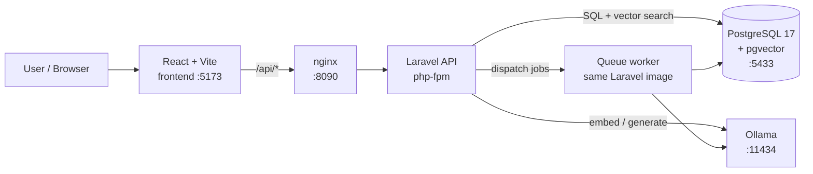
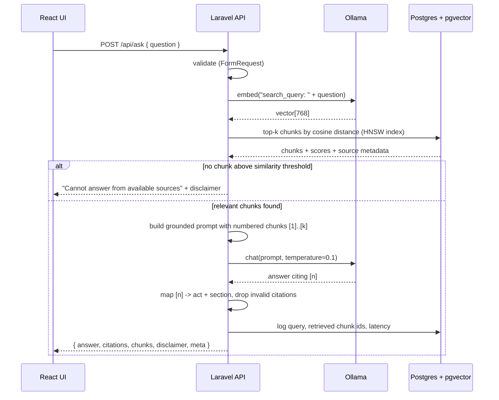
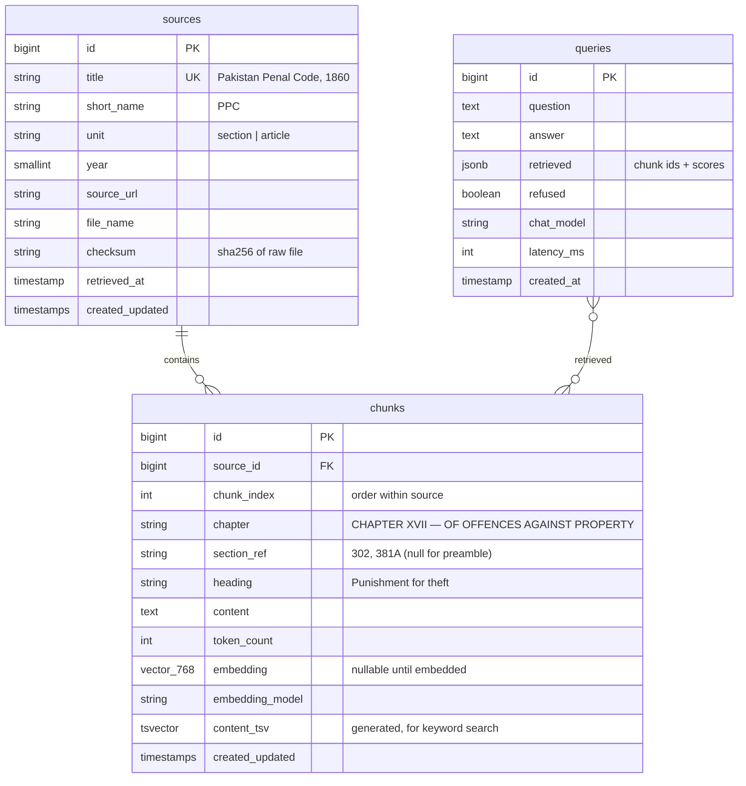

# Architecture

This document defines how the Pakistan Law Assistant is put together: the services, how a
question flows through them, the database schema, the API contract, and the reasoning behind
each choice. Update it whenever a decision changes.

## 1. System overview



All services run in Docker Compose on one network. Only the ports above are exposed to the host.

| Service    | Image / base                 | Host port | Responsibility |
|------------|------------------------------|-----------|----------------|
| `frontend` | `node:22-alpine` (Vite dev)  | 5173      | Chat UI, citation display |
| `nginx`    | `nginx:alpine`               | 8090      | HTTP entry point for Laravel |
| `backend`  | `php:8.4-fpm` + extensions   | –         | Laravel 13 REST API, retrieval, prompt building |
| `worker`   | same image as `backend`      | –         | `php artisan queue:work` for ingestion & embedding jobs |
| `db`       | `pgvector/pgvector:pg17`     | 5433      | Sources, chunks, embeddings, query logs |
| `ollama`   | `ollama/ollama`              | 11434     | Local embedding + chat models |

Host ports avoid conflicts with services already running on the dev machine (80, 8000, 8080, 3306).

## 2. Request flow: answering a question



## 3. Ingestion flow

```
data/raw/<act>.pdf|txt
   │  php artisan law:ingest raw/<act>.pdf --title="Pakistan Penal Code, 1860" --short=PPC --from-page=30
   ▼
DocumentTextExtractor   pdftohtml -xml → keep only body-size text (drops footnotes and
   │                    footnote markers, which use a smaller font) → rebuild lines → drop "Page N of M"
   ▼
LegalTextChunker        one chunk per section/article ("379. Punishment for theft. ...")
   │                    • heading and chapter recorded for each chunk
   │                    • sections > 500 tokens → overlapping windows (50-token overlap)
   │                    • repealed stubs / bare sub-headings (< 8 words) dropped
   ▼
IngestionService        one transaction: upsert `sources` row, replace its `chunks` (embedding = NULL)
   ▼
EmbedChunks jobs        batches of 16 → worker → Ollama /api/embed("search_document: PPC s.379 — heading\n...")
   ▼
chunks.embedding, embedding_model filled in       (check progress: php artisan law:status)
```

Ingestion is **idempotent**. A source is identified by its title, and the file's sha256 checksum
is stored with it. Re-ingesting an unchanged file does nothing, unless `--force` is given. A changed file
replaces that source's chunks.

**Why PDF font sizes rather than plain text:** `pdftotext` mixes amendment footnotes into the
body ("2Subs. by Ord. 21 of 1960...") and glues footnote markers to words ("2[Pakistan]"). In the
official Pakistan Code PDFs, those are typeset smaller than the body text. Filtering by font size
removes them reliably, which regex clean-up can't.

**Section detection rules** (`LegalTextChunker`):
- A line starting with `379.`, `381A.`, `[302.` or `[ [ 478.` starts a section. The number must
  increase, and jumps of more than 25 are rejected. This keeps cross-references that wrap onto a
  new line ("…under section\n420.") from being mistaken for new sections.
- The heading is the text up to the first `.` or `;`, followed by `__`, `-`, `—`, `––` or a space. If there's no
  punctuation, the heading ends where the rule text begins ("Whoever…", "Whenever…").
- Paragraph breaks are kept before `(a)`, `Explanation`, `Illustration`, `Exception` and `Provided`.

**First act ingested:** Pakistan Penal Code, 1860, from pakistancode.gov.pk (179-page PDF; the text
starts at page 30). The result is 666 chunks covering 631 sections. 2 numbers are absent because
the provisions are repealed: s.18 and s.325.

## 4. Models (Ollama)

| Purpose    | Default model        | Why |
|------------|----------------------|-----|
| Embeddings | `nomic-embed-text`   | Small (~270 MB), 768 dimensions, strong retrieval quality, runs fast on CPU |
| Chat       | `qwen2.5:3b`         | ~2 GB, good instruction-following for its size, workable on CPU without a GPU |

Both models are set by environment variables (`OLLAMA_EMBED_MODEL`, `OLLAMA_CHAT_MODEL`), so you
can swap in a larger model (e.g., `llama3.1:8b`) on a machine with more RAM or a GPU.

**Rule:** the embedding model and the `vector(768)` dimension are linked. Changing the embedding
model requires a migration and re-embedding all chunks. `chunks.embedding_model` records the
model that produced each vector so mismatches can be detected.

## 5. Database schema (PostgreSQL + pgvector)



Indexes:
- `chunks.embedding`: **HNSW** with `vector_cosine_ops`. It gives fast approximate nearest-neighbour search and, unlike IVFFlat, needs no training step.
- `chunks.content_tsv`: **GIN** index. It is reserved for hybrid search (later improvements), where an exact section number such as "302" is better matched by keyword than by embedding.
- `chunks (source_id, chunk_index)` is unique, and `chunks (source_id, section_ref)` is indexed for lookups by section.

Citations are formatted from `sources.short_name`, `sources.unit` and `chunks.section_ref`:
`PPC s.379` or `Constitution Art.25` (`Source::cite()`).

The `queries` table is created in the answering phase.

## 6. API contract (v1)

Base URL: `http://localhost:8090/api`

| Method | Path        | Purpose |
|--------|-------------|---------|
| GET    | `/health`   | Checks DB and Ollama reachability |
| GET    | `/sources`  | Lists ingested acts (for filter UI) |
| POST   | `/ask`      | Asks a question |

`POST /api/ask`

```json
{ "question": "What is the punishment for theft?", "source_ids": [2] }
```

Response `200`:

```json
{
  "answer": "Under the PPC, theft is punishable with imprisonment up to three years, or fine, or both [1].",
  "refused": false,
  "citations": [
    { "ref": 1, "chunk_id": 412, "source": "Pakistan Penal Code, 1860", "section": "s.379" }
  ],
  "chunks": [
    { "chunk_id": 412, "source": "Pakistan Penal Code, 1860", "section": "s.379",
      "content": "379. Punishment for theft ...", "score": 0.82 }
  ],
  "disclaimer": "Informational only — not legal advice.",
  "meta": { "chat_model": "qwen2.5:3b", "latency_ms": 5400 }
}
```

Errors use Laravel's standard JSON shape: `422` for validation errors and `503` when Ollama or the DB is unavailable.

The answer is returned in one piece in v1. Streaming over Server-Sent Events is planned as a later improvement.

## 7. Laravel backend structure

```
backend/app/
├── Http/
│   ├── Controllers/Api/AskController.php      # thin: validate → AnswerService → resource
│   ├── Controllers/Api/SourceController.php
│   ├── Controllers/Api/HealthController.php
│   ├── Requests/AskRequest.php
│   └── Resources/AnswerResource.php
├── Services/
│   ├── Ollama/OllamaClient.php                # HTTP wrapper: embed(), chat()
│   ├── Ingestion/DocumentTextExtractor.php     # PDF/TXT → body text (font-size filter)
│   ├── Ingestion/LegalTextChunker.php          # split by Article/Section, fallback windows
│   ├── Ingestion/IngestionService.php          # checksum, store source + chunks, embedding batches
│   ├── Retrieval/Retriever.php                 # vector search, threshold, source filter
│   ├── Answering/PromptBuilder.php             # grounded prompt template
│   ├── Answering/CitationParser.php            # [n] → chunk/section, drops invalid refs
│   └── Answering/AnswerService.php             # orchestrates retrieve → prompt → generate
├── Jobs/EmbedChunks.php
├── Console/Commands/IngestLegalText.php       # php artisan law:ingest
├── Console/Commands/LegalSourcesStatus.php    # php artisan law:status
└── Models/{Source,Chunk,Query}.php
config/rag.php                                  # top_k, similarity_threshold, models, prompt
```

Key packages: `pgvector/pgvector` (PHP) for the Eloquent vector cast and distance queries.
Ollama is called through Laravel's `Http` client, so no extra SDK is needed and tests can use `Http::fake()`.

## 8. React frontend structure

```
frontend/src/
├── api/client.ts            # fetch wrapper, typed request/response
├── types.ts                 # Answer, Citation, Chunk, Source
├── components/
│   ├── ChatWindow.tsx
│   ├── MessageBubble.tsx    # renders [n] as clickable citation markers
│   ├── SourcePanel.tsx      # shows retrieved chunk text for a citation
│   ├── SourceFilter.tsx
│   └── Disclaimer.tsx
└── App.tsx
```

The frontend uses React with TypeScript and Vite. The Vite dev server proxies `/api` to `nginx:8090`, which avoids CORS in development. Chat state lives in React state for v1, with no global store.

## 9. Configuration (`.env`)

| Variable                   | Default                  |
|----------------------------|--------------------------|
| `DB_HOST` / `DB_PORT`      | `db` / `5432` (inside Docker) |
| `DB_DATABASE`              | `law_assistant`          |
| `OLLAMA_BASE_URL`          | `http://ollama:11434`    |
| `OLLAMA_EMBED_MODEL`       | `nomic-embed-text`       |
| `OLLAMA_CHAT_MODEL`        | `qwen2.5:3b`             |
| `RAG_TOP_K`                | `5`                      |
| `RAG_SIMILARITY_THRESHOLD` | `0.55` (tune with eval set) |
| `OLLAMA_TIMEOUT`           | `120` seconds (CPU generation is slow) |

## 10. Key decisions and trade-offs

| Decision | Alternatives considered | Reason |
|----------|-------------------------|--------|
| pgvector inside Postgres | Qdrant, Chroma, Pinecone | One database for relational data and vectors, SQL joins to source metadata, no extra service. It performs well at this scale (thousands of chunks). |
| Ollama local models | OpenAI / Claude APIs | Free, offline and private; it also shows model-serving know-how. The trade-off is lower answer quality and slower CPU inference. |
| Laravel calls Ollama directly | Separate Python RAG service (LangChain) | Fewer moving parts. The whole pipeline stays visible in plain code, which is easier to explain in interviews than framework magic. |
| Structure-aware chunking | Fixed-size chunks only | Legal text is naturally addressed by section or article. This makes citations precise and chunks self-contained. |
| Refusal threshold | Always answer | Grounding requirement: when nothing relevant is retrieved, the assistant must not invent law. |
| Queue for embeddings | Embed synchronously | Embedding thousands of chunks on CPU is slow, and jobs make it retryable and non-blocking. |
| HNSW index | IVFFlat, no index | No training step, good recall, and it works while data is added incrementally. |
| PHP only in Docker | Host PHP | Host has PHP 7.4; the project targets Laravel 13 on PHP 8.4. Docker pins the version for everyone. |

## 11. Resource constraints

The dev machine has 15 GB RAM and no GPU. To keep inference usable:
- Use 3B-class chat models. Expect roughly 5–15 seconds per answer on CPU.
- Keep `top_k` small (5) and chunks around 500 tokens, which keeps the prompt about 3k tokens.
- Ollama model data is stored in a named Docker volume so models are downloaded only once.

## 12. Build phases

1. **Infrastructure** ✅: Docker Compose with `db`, `ollama`, `backend`, `nginx`, `worker` and `frontend`, plus a health endpoint.
2. **Schema & ingestion** ✅: migrations, chunker, `law:ingest`, embedding jobs and one act ingested.
3. **Retrieval:** the `Retriever`, threshold handling and a debug endpoint/command to inspect results.
4. **Answering:** prompt builder, citation parser and `POST /api/ask`, with tests using `Http::fake()`.
5. **Frontend:** chat UI, citations, source panel and disclaimer.
6. **Evaluation:** a set of questions with expected sections, to measure retrieval hit-rate and refusal accuracy.
7. **Later improvements:** hybrid search (vector + full-text), SSE streaming, reranking, CI with GitHub Actions.
